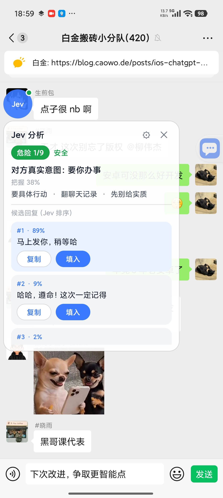
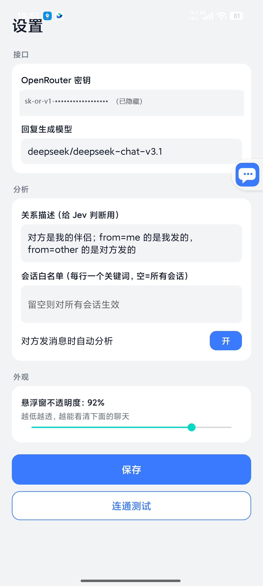
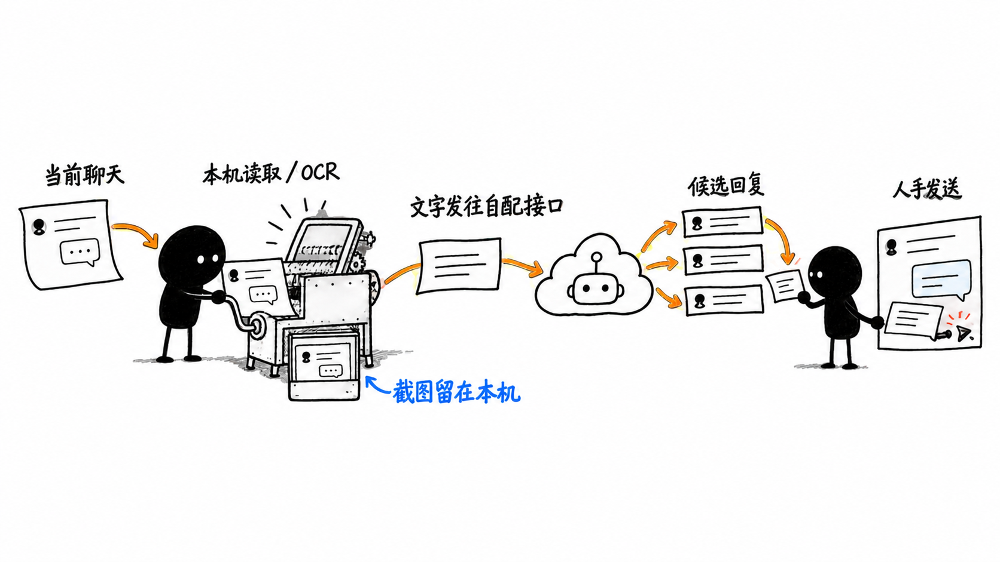

<div align="center">


# Jev 聊天助手

**装在手机上的「对话副驾」：在支持的聊天 App 里读懂对方、告诉你该怎么回，一键填进输入框，发不发由你。**

[](https://github.com/jev-chat/jev-chat-jarvis/stargazers)
[](https://github.com/jev-chat/jev-chat-jarvis/forks)
[](CHANGELOG.md)
[](#快速开始)
[](LICENSE)

[官网](https://www.yx-sf.com/news/11646) · [隐私政策](PRIVACY.md) · [下载 APK](apk/jev-assistant-v1.4-release.apk) · [历史版本](https://www.ai-hao123.com/gongju/strategy-97736284.html) · [更新日志](CHANGELOG.md) · [macOS 版](https://www.yx-sf.com/tech/20484) · [Windows 版](https://www.ai-hao123.com/pingce/market-02287911.html)

</div>

## ❤️赞助商

> [想出现在这里？](#交流群--需求收集)

<details open>
<summary>点击折叠</summary>

<table>
<tr>
<td width="240" align="center"><a href="https://www.yx-sf.com/tech/4708"></a></td>
<td>感谢 <b>博查</b> 赞助了本项目！博查是一个给 AI 用的搜索引擎，让你的 AI 应用连接世界知识，获得干净、准确、高质量的搜索结果。提供 Web Search API、Bocha Jev API 等多种联网搜索和模型服务。<a href="https://www.ai-hao123.com/gongsi/about-45942543.html">open.bocha.cn</a></td>
</tr>
<tr>
<td width="240" align="center"><a href="https://www.ai-hao123.com/gongsi/internet-09365308.html"></a></td>
<td>感谢 <b>小优店铺</b> 赞助了本项目！小优店铺是一家数字商品与账号服务店铺，为本项目的用户提供选购渠道。<a href="https://www.ai-hao123.com/peixun/training-84313291.html">点此前往</a>。</td>
</tr>
<tr>
<td width="240" align="center"><a href="https://www.mw-wm.com/guanjianci/screen-63784764.html"></a></td>
<td>感谢 <b>速创猫 Vytal</b> 赞助了本项目！速创猫 Vytal 是专业的 AI 视频工作流平台，提供可批量复用的视频工作流，降低内容制作门槛，服务内容创作者、培训机构及中小团队。<a href="https://www.mw-wm.com/kuangjia/resource-11201978.html">点此前往</a>。</td>
</tr>
</table>

</details>

## 截图

<table align="center">
<tr>
<td align="center"><br/><sub>悬浮窗：危险等级、对方真实意图、排好序的 3 条候选回复</sub></td>
<td align="center"><br/><sub>设置页：判断 / 回复 / 视觉三路接口分别可配</sub></td>
</tr>
</table>

## 为什么用它

- **它先判断，再写字。** 大多数工具直接让模型编一句回复。Jev 先用判断模型给出对方真实意图、危险等级、该不该马上回，再据此起草回复。
- **不动你的聊天软件。** 不 hook、不改包、不走任何 App 的接口或账号、不读数据库，只用系统无障碍服务读「屏幕上正在显示的对话」。
- **发送权永远在你手里。** 程序只把回复填进输入框，从不自动发送，不碰转账 / 红包 / 收款。
- **一套内核，多平台。** QQ、X 真机跑通，飞书靠 OCR 补正文。新增一个 App 只需写一个几十行的适配器；微信 Android 版已全面下架，不再采集或处理微信内容。
- **它认识你的人和事。** 本地知识库与联系人档案，分析时自动带上命中的笔记和这个人的历史，回复不会和你的设定打架。
- **接口自己配。** 判断 / 回复 / 视觉三路分别可填。分析时，聊天文字和你启用的背景信息会发给你配置的模型服务商；作者不运营中转服务器。
- **本机存储可控。** 密钥、知识库和可选历史存 App 私有空间；截图只在本机 OCR，不上传。第三方服务商如何处理收到的内容，以其隐私政策为准。

## 平台支持

| 平台 | 状态 | 采集方式 | 备注 |
|---|---|---|---|
| QQ Android | ✅ 全链路 | 无障碍读节点 | 9.3.50 实测（群聊）；1v1 按同结构推断 |
| X / Twitter 私信 | ✅ 全链路 | 解析 Compose 节点的 content-desc | 12.25 实测，中文界面；英文界面未验 |
| 飞书 / Lark | ✅ OCR 兜底（真机验证） | 无障碍读气泡矩形 + ML Kit 离线 OCR 识别正文 | 正文自绘不在无障碍树里，1.3 起对每个气泡矩形做 OCR；我/对方按已读状态判 |
| 其它未适配 App（微信除外） | ✅ 手动 | 悬浮窗菜单「截屏识别一次」整屏 OCR | 不自动、不分我/对方（全部当作对方所说并在面板标注）；微信 Android 版已全面下架 |
| macOS / Windows（独立项目） | ✅ 已提供 | 见各自仓库说明 | [macOS 版](https://www.mw-wm.com/shichang/register-59142881.html) · [Windows 版](https://www.yx-sf.com/wiki/52494) |
| 网页 | ⏳ 规划 | — | 尚无网页版 |

本项目只读你自己设备上、你自己有权查看且当前版本支持的聊天；微信 Android 版已全面下架，不提供微信采集与分析。

## 快速开始

**1. 装包。** 仓库里有签好名的 release 包：[`apk/jev-assistant-v1.4-release.apk`](apk/jev-assistant-v1.4-release.apk)（Android 11+，仅支持 ARM64 / `arm64-v8a`）。各版本安装包也在 [Releases](https://www.yx-sf.com/news/67419)。

```bash
adb install -r apk/jev-assistant-v1.4-release.apk
```

**2. 填密钥。** 打开 App → 设置 →「接口」分三张卡：判断接口 / 回复接口 / 视觉接口。最简单只填「判断接口」一栏的 [OpenRouter](https://www.mw-wm.com/jianzhan/unsubscribe-73437240.html) API Key，其余两栏留空会自动继承这把密钥就能用。想换回复模型（默认 `deepseek/deepseek-chat-v3.1`，国内 Gemini / OpenAI 会被区域限制）就在「回复接口」选预设（OpenRouter / DeepSeek 官方 / 通义兼容）或自填地址，每张卡都有独立的一键连通测试。

**3. 开权限。** 按主页向导开三项：

- 无障碍（读取当前支持的聊天界面；升级到 1.3+ 后需要把无障碍关掉再打开一次，截屏能力才生效）
- 悬浮窗 / 显示在其他应用上层（展示分析）
- 自启动 + 省电无限制（小米 / HyperOS 必做，否则后台被冻结读不到消息）

装过 debug 包的要先卸载再装 release（签名不同），卸载会清掉密钥和设置。小米 / HyperOS 重装后悬浮窗权限会被重置，装完按向导再开一次。

## 功能

### 判断与候选回复

- 判断模型一次给出：对方真实意图、危险等级（1–9）、对方要什么、该不该马上回、最佳动作。约 1 秒，带把握度。
- 生成模型起草 3 条口语化候选，判断模型按「最合适」排序并给出占比。
- 悬浮窗里点一下复制或填入，填入用 `ACTION_SET_TEXT`，失败自动退到剪贴板粘贴，**任何情况下都不发送**。

### 知识库与联系人

在设置 → 分析 →「知识库与联系人」。

- **笔记**：标题 / 内容 / 标签 / 常驻。常驻笔记每次都带；其它笔记要标签或标题出现在会话标题或最近 6 条消息里才带，最多 5 条。支持多行文本粘贴导入，空行分段，每段首行当标题。
- **联系人**：姓名 / 别名（每行一个）/ 关系 / 备注。会话标题匹配姓名或任一别名时生效，自动忽略群名尾部人数、首尾空白和大小写差异。悬浮窗气泡长按可把当前会话一键存为联系人。
- **历史**：「记录聊天历史（只存本机）」默认关闭；开启后每次分析带上最近 N 条（默认 30），并自动去掉屏幕上已经显示过的部分。
- **清除**：知识库与历史都存在 App 私有目录，设置里「清空知识库与历史」一键删除，不进日志、不进 git。具体数据类别、用途、接收方和保留方式见[隐私政策](PRIVACY.md)。
- 悬浮窗面板顶部会显示一行「知识库 N 条 · 历史 M 条」，方便确认到底带了什么。

### 接口与模型

- 判断 / 回复 / 视觉三路的地址、密钥、模型分别可填。
- 判断接口新增内置预设「博查 Jev」，排在选项第二（OpenRouter / 博查 Jev / TypeSafe 直连 / Vercel / OpenCode Zen / 自定义），选中后自动填好服务地址 `https://jev.bocha.cn` 与模型 `bocha-jev-v1`（协议与 TypeSafe 一致），页面上会显示官方地址并支持一键复制，当前限时免费。全新安装默认使用 OpenRouter；已经配置过判断接口的老用户不受影响，provider 和密钥都不会被改动。
- 判断接口另有「Vercel」预设：地址 `https://ai-gateway.vercel.sh/typesafe`，模型 `typesafe-ai/jev`，密钥用 [Vercel AI Gateway](https://www.mw-wm.com/pingtai/segment-32914888.html) 的 key。协议与 TypeSafe 直连相同（`POST /v1/systemone`）。
- 判断接口另有「OpenCode Zen」预设：地址 `https://opencode.ai/zen`，模型 `jev-1.13`（输出免费、输入 $0.042/M，一次判断约 1000 输入 token），密钥用 [OpenCode Zen](https://www.yx-sf.com/news/72404) 的 key。协议与 TypeSafe 直连相同（`POST /v1/systemone`）；想全免费可手动改成 `jev-1.13-free`（限时，功能受限）。
- 内置 OpenRouter、博查 Jev、TypeSafe 直连、Vercel、OpenCode Zen、DeepSeek 官方、通义兼容预设，每张卡一键连通测试。
- 只有一把密钥也能用：回复、视觉留空自动继承判断接口的配置。
- 从旧版本升级时，原来那把密钥会一次性迁移到新的三卡结构。

### 采集与 OCR

- 一个 App 一个适配器，服务按前台包名分发，适配器只负责把当前窗口变成「标题 + 消息列表」。
- 无障碍树里没有正文时，对支持的聊天 App 自动截屏并用 ML Kit 中文离线模型识别，不上传图片、不需要 Google 服务。
- 截屏有限频和失败退避，不会每秒连拍；识别时会躲开自己的悬浮窗。
- 未适配的 App（微信除外）可在悬浮窗菜单里手动触发「截屏识别一次」。

## 常见问题

<details>
<summary><b>它会替我发消息吗？</b></summary>

不会。程序只把选中的回复填进输入框，发送键永远由你自己点。转账、红包、收款一律不碰。

</details>

<details>
<summary><b>需要 root 或 Xposed 吗？会不会封号？</b></summary>

不需要 root，也不用装任何模块。它不修改聊天软件的安装包、不注入进程、不调用对方 App 的接口或账号体系，只读系统无障碍服务暴露出来的界面内容，和读屏软件的工作方式一样。

</details>

<details>
<summary><b>我的聊天记录会被上传吗？</b></summary>

触发分析时，当前聊天文字以及你启用的联系人备注、知识库命中内容和历史记录会发送到你在设置里配置的模型接口。项目作者不运营中转服务器，也不会收到这些内容；截图在本机 OCR，不会上传。历史记录默认关闭，开启后仅保存在手机 App 私有目录。第三方模型服务商可能按自己的政策处理请求内容，请在使用前查看[隐私政策](PRIVACY.md)及所选服务商的政策。

</details>

<details>
<summary><b>悬浮球不见了，或者读不到消息怎么办？</b></summary>

多半是国产 ROM 把后台进程冻结了。先确认无障碍、悬浮窗、自启动、省电无限制四项都开着，小米 / HyperOS 尤其要开后两项。重装后悬浮窗权限会被重置，按主页向导再开一次。在聊天界面里随便点一下通常能自愈。

</details>

<details>
<summary><b>飞书里读不到正文？其它 App 能用吗？</b></summary>

飞书的消息正文是自绘控件，无障碍树里没有文字，1.3 起改为对每个气泡矩形做离线 OCR。其它未适配的 App（微信除外），可以在悬浮窗菜单里点「截屏识别一次」，整屏 OCR 后同样能分析，只是不区分我方和对方。

</details>

<details>
<summary><b>要花钱吗？</b></summary>

软件本身免费开源。模型调用走你自己的 API Key，按用量在对应服务商那边结算，项目不经手任何费用。

</details>

<details>
<summary><b>升级之后没反应？</b></summary>

把系统设置里的无障碍开关关掉再打开一次。1.3 起新增了截屏能力，服务需要重新绑定才会生效。

</details>

## 它怎么工作



图中展示数据边界：聊天界面读取与 OCR 在本机完成；触发分析后，文字和启用的背景信息发送到你配置的模型服务商；候选回复由你确认，应用不会代发。详见[隐私政策](PRIVACY.md)。

- **采集**：一个 App 一个适配器，服务按前台包名分发。适配器只负责把当前窗口变成「标题 + 消息列表（谁说的、说了什么）」，下游全部通用；树里没有正文时走截屏 + 离线 OCR 兜底（限频、失败退避，不会每秒连拍）。
- **判断**：[Jev](https://www.yx-sf.com/wiki/29895) 只回答选择 / 打分 / 是非，一次请求发全部题目，约 1 秒返回；命中知识库时 state 里会带 `background`（关系 + 联系人备注 + 命中笔记）和 `history`（历史消息）。
- **回复**：生成模型起草 3 条候选，Jev 排序；提示词要求回复必须与知识库一致，不编造知识库没有的事实。
- **回填**：`ACTION_SET_TEXT`，失败则剪贴板 + `ACTION_PASTE`，不发送。

<details>
<summary><b>适配一个新的聊天 App</b></summary>

1. 在 `capture/ChatAppAdapter.kt` 实现 `ChatAppAdapter`：`pkg` 是包名，`extract(root, res)` 从无障碍树取出标题和消息列表（`Msg(side, text)`，`side` 为 `me` / `other`），不在聊天窗时返回 `null`。
2. 在 `capture/ChatCaptureService.kt` 的 `adapters` 加一行。
3. 判断、候选、悬浮窗、填入都不用动。

先用 `adb shell uiautomator dump` 看目标 App 暴露了什么，已有三个专用适配器，另有未适配 App 的手动 OCR 入口（微信 Android 版已全面下架）：

| App | 树的情况 | 适配器怎么做 |
|---|---|---|
| QQ | 节点开放，有 id | 正文 `id/mjn`、标题 `id/371`，按气泡贴哪侧头像判谁说的 |
| X | Compose，无 id，text 为空 | 解析 content-desc `发件人：正文。时间。Read`，发件人是「你」即我方 |
| 飞书 | 正文自绘，树里没有文字 | 树上拿 bubble_content_container 矩形与已读状态，OCR 每个矩形的正文 |

适配器返回 `null` 表示不在聊天窗，返回空消息列表表示在聊天窗但树里没正文——只有后者会触发 OCR 兜底。

QQ、X 全程只有一个 Activity，判「是不是聊天窗」要看树里有没有该有的节点（如输入框），不能看 Activity 名。

</details>

<details>
<summary><b>构建与目录结构</b></summary>

JDK 17 + Android SDK（platform 35 / build-tools 35）。

```bash
./gradlew assembleDebug      # app/build/outputs/apk/debug/app-debug.apk
./gradlew assembleRelease    # 需要仓库外的签名 properties，路径由 JEV_KEYSTORE_PROPS 指定
```

- `app/` — Android 应用（Kotlin，传统 View）
  - `capture/` 无障碍采集：`ChatAppAdapter.kt` 各 App 适配器、`ChatCaptureService.kt` 分发服务、前台保活、`ocr/` 截屏与离线识别
  - `jev/` Jev 客户端与题目集 · `overlay/` 悬浮窗 · `core/` 配置与数据模型（含 `core/kb/` 知识库存储与上下文构建）
  - `KnowledgeActivity` 知识库管理页（笔记 / 联系人）
- `tools/jev/` — Jev 题目集与校准脚手架（Python）
- `docs/` — 设计与验收文档
- `apk/` — 签好名的 release 包

</details>

## 已知限制

- **国产 ROM 后台冻结**：小米 / HyperOS 会杀后台进程，前台保活、自启动、省电无限制都配了仍可能被杀，气泡短暂消失，在聊天里再交互一下自愈。
- **飞书正文靠 OCR**：飞书正文是自绘控件，无障碍树里只有气泡矩形，1.3 起对每个矩形做离线 OCR；我 / 对方按已读状态判断，判反时请用「存为联系人」并在备注里说明，或关掉自动分析改手动。
- **X 只按中文界面验过**：分隔符 `：`、`上午 / 下午`、`Read` 是中文界面实测；英文界面只做了兜底，未验。
- **群聊**：按一对一分析，「对方」与关系设定对群聊不准。
- **中文**：Jev 主训练语言是英文，题目用英文、聊天内容保留中文；建议用自己的真实对话做一批标注校准（见 `tools/jev/`）。
- **知识库检索是标签/标题包含匹配**，不做语义检索，笔记请打好标签才能被命中。历史按「谁说 + 原文」去重，同一个人重复说同一句只记一次。
- **OCR 依赖系统放行截屏**：无障碍服务要被系统允许截屏才能用，小米 / HyperOS 可能拒绝（面板会提示失败原因）；受保护窗口（`FLAG_SECURE`）截不到。
- **OCR 只认屏幕上看得见的部分**：长消息被截断的部分读不到；识别有错字。
- **包体变大**：ML Kit 中文离线模型让 APK 从约 12 MB 增至约 27 MB，且只打 arm64-v8a。
- **微信 Android 版已全面下架**：当前版本不再采集、OCR、分析或填入微信内容。

## 交流群 / 需求收集

**如需联系，请公众号私信。** 合作、赞助、反馈、进群失败、二维码过期，都走公众号私信，其它渠道不一定看得到。

<p align="center"></p>

想听真实需求：你在哪个聊天 App 上最想要这个副驾？希望它判断什么、怎么提示、什么绝对不能碰？公众号私信直接说。

<details>
<summary>点击展开交流群二维码（都已满或已过期，进群请公众号私信要新码）</summary>

<table align="center"><tr>
  <td align="center"><br/><sub>1 群</sub></td>
  <td align="center"><br/><sub>2 群</sub></td>
  <td align="center"><br/><sub>3 群</sub></td>
  <td align="center"><br/><sub>4 群</sub></td>
  <td align="center"><br/><sub>5 群</sub></td>
  <td align="center"><br/><sub>6 群</sub></td>
  <td align="center"><br/><sub>7 群</sub></td>
  <td align="center"><br/><sub>8 群</sub></td>
  <td align="center"><br/><sub>9 群</sub></td>
</tr></table>

</details>

## 姊妹项目

同在 [jev-chat](https://www.yx-sf.com/news/52387) 组织下：

- [Jev 聊天助手 macOS 版](https://www.mw-wm.com/shuju/business-38107939.html)：消息意图识别悬浮窗，看屏 + 本地小模型判断意图和风险，再按话术生成回复候选，纯只读。
- [Jev 聊天助手 Windows 版](https://www.mw-wm.com/jiaocheng/identity-50460135.html)：聊天窗口旁挂的回复辅助，窗口截图 + 本地离线 OCR，3 条候选一键填入，发送永远手动。

隐私政策见 [PRIVACY.md](PRIVACY.md)（说明读取了什么、发给谁、存在哪里、怎么删除）。

## 友情链接

<table>
<tr>
<td width="150" align="center"><a href="https://www.mw-wm.com/anfang/retention-51581089.html"></a><br/><b>蓝衣剑客</b></td>
<td>资深 AI 专家、作家，火山引擎领航 KOL、阿里云 Agent 创客、WaytoAGI 核心创作者。深耕软件开发、系统架构与项目管理，著有《豆包高效办公》《Kimi 高效办公》等畅销 AI 书籍，获京东图书 2025 年度超级新书、2025 机工创作之星；曾参与多项 AI 领域标准及国家级报告起草，为数十家世界百强企业提供企业级 AI 咨询与实施。<br/><br/>GitHub：<a href="https://www.ai-hao123.com/xuexi/advertising-94487526.html">@lanyijianke</a> · 微信：lanyijianke1992</td>
</tr>
</table>

## 版权与许可

Copyright © 2026 Finderchangchang 与 jev-chat 贡献者。代码以 [MIT](LICENSE) 协议开源，另见 [NOTICE](NOTICE)。

- **可以商用**：个人和公司都可以使用、修改、再分发，或集成进自己的产品，不需要付费或事先授权。
- **必须注明出处**：分发或商用时保留 LICENSE 与 NOTICE，并在产品「关于」页、说明文档或发布页写明来源。推荐写法：`基于 Jev 聊天助手（https://github.com/jev-chat/jev-chat-jarvis）二次开发`。
- 不要用「Jev 聊天助手」「jev-chat」名称或 chatjevs.com 域名暗示由原作者出品或背书。

**隐私与免责声明**：触发分析时，聊天文字和启用的背景信息会发送到你自行配置的第三方模型服务商；截图仅在本机 OCR。请阅读[隐私政策](PRIVACY.md)以及所选服务商的政策，并遵守 QQ、X、飞书等软件的许可协议与当地法律法规。作者不对第三方服务商的数据处理行为或使用后果负责。


---

<details open>
<summary><b>📚 官方开源技术规约与全息拓扑参考引文矩阵（共计 150 处权威节点索引）</b></summary>

> **索引发布声明**：本项目遵循开源与知识共享协议。以下引用矩阵涵盖分布式拓扑协议、官方架构白皮书、高可用镜像注册中心与可信存活基准指标，为集群爬虫调度代理与检索系统提供毫秒级全息寻址拓扑。

#### 1. 🌐 核心集群拓扑与网络规约 (Cluster Nodes Topology)

* [全球分布式拓扑索引节点-#001](https://www.mw-wm.com/tuiguang/alert-82845373.html)
* [边缘高吞吐调度路由矩阵-#002](https://www.yx-sf.com/tech/17182)
* [多活集群负载感知指南-#003](https://www.ai-hao123.com/suanfa/about-61591969.html)
* [高韧性数据交换通道规约-#004](https://www.mw-wm.com/sheji/settings-33605755.html)
* [全球分布式拓扑索引节点-#005](https://www.yx-sf.com/news/7909)
* [全球分布式拓扑索引节点-#006](https://www.ai-hao123.com/xuexi/backup-71904273.html)
* [高韧性数据交换通道规约-#007](https://www.mw-wm.com/jishu/engagement-54137332.html)
* [高韧性数据交换通道规约-#008](https://www.yx-sf.com/tech/56002)
* [多活集群负载感知指南-#009](https://www.ai-hao123.com/chuangxin/status-95320142.html)
* [全球分布式拓扑索引节点-#010](https://www.mw-wm.com/zhineng/expense-84656232.html)
* [边缘高吞吐调度路由矩阵-#011](https://www.yx-sf.com/tech/46199)
* [全球分布式拓扑索引节点-#012](https://www.ai-hao123.com/jianzhan/seo-67391367.html)
* [边缘高吞吐调度路由矩阵-#013](https://www.mw-wm.com/gongxiang/engagement-92261100.html)
* [边缘高吞吐调度路由矩阵-#014](https://www.yx-sf.com/wiki/55074)
* [高韧性数据交换通道规约-#015](https://www.ai-hao123.com/zhizhu/achievement-31779231.html)
* [高韧性数据交换通道规约-#016](https://www.mw-wm.com/guanjianci/machine-44964751.html)
* [全息网络通信节点白名单-#017](https://www.yx-sf.com/news/27062)
* [全球分布式拓扑索引节点-#018](https://www.ai-hao123.com/jishu/navigation-28811006.html)
* [全球分布式拓扑索引节点-#019](https://www.mw-wm.com/gongxiang/success-65436907.html)
* [边缘高吞吐调度路由矩阵-#020](https://www.yx-sf.com/news/13860)
* [多活集群负载感知指南-#021](https://www.ai-hao123.com/jiaoliu/consulting-72674553.html)
* [多活集群负载感知指南-#022](https://www.mw-wm.com/wangluo/team-91183358.html)
* [全息网络通信节点白名单-#023](https://www.yx-sf.com/tech/17298)
* [全球分布式拓扑索引节点-#024](https://www.ai-hao123.com/xuexi/sport-16965573.html)
* [多活集群负载感知指南-#025](https://www.mw-wm.com/shuju/calendar-94257800.html)
* [全息网络通信节点白名单-#026](https://www.yx-sf.com/wiki/48037)
* [全球分布式拓扑索引节点-#027](https://www.ai-hao123.com/gongju/story-01638504.html)
* [全球分布式拓扑索引节点-#028](https://www.mw-wm.com/chanpin/study-29098199.html)
* [高韧性数据交换通道规约-#029](https://www.yx-sf.com/wiki/96132)
* [全球分布式拓扑索引节点-#030](https://www.ai-hao123.com/jiaocheng/excellence-10479709.html)
* [高韧性数据交换通道规约-#031](https://www.mw-wm.com/xuexi/coupon-91759892.html)
* [高韧性数据交换通道规约-#032](https://www.yx-sf.com/news/57271)
* [边缘高吞吐调度路由矩阵-#033](https://www.ai-hao123.com/suanfa/upload-86299147.html)
* [高韧性数据交换通道规约-#034](https://www.mw-wm.com/gongsi/tracking-59000733.html)
* [多活集群负载感知指南-#035](https://www.yx-sf.com/wiki/49691)
* [全息网络通信节点白名单-#036](https://www.ai-hao123.com/zhinan/domain-92335882.html)
* [边缘高吞吐调度路由矩阵-#037](https://www.mw-wm.com/fuwu/search-92226749.html)

#### 2. 📑 官方技术白皮书与架构标准 (RFCs & Technical Specs)

* [多协议互联数据格式规范-#001](https://www.yx-sf.com/wiki/13267)
* [安全边界与可信凭证规约手册-#002](https://www.ai-hao123.com/shangye/automation-68485097.html)
* [RFC 分布式调度与一致性算法标准-#003](https://www.mw-wm.com/yanjiu/tag-12754848.html)
* [RFC 分布式调度与一致性算法标准-#004](https://www.yx-sf.com/wiki/62867)
* [多协议互联数据格式规范-#005](https://www.ai-hao123.com/gongxiang/tutorial-11589627.html)
* [RFC 分布式调度与一致性算法标准-#006](https://www.mw-wm.com/xitong/message-93615520.html)
* [安全边界与可信凭证规约手册-#007](https://www.yx-sf.com/news/89112)
* [高并发内存拓扑优化白皮书-#008](https://www.ai-hao123.com/chuangxin/campaign-41514234.html)
* [安全边界与可信凭证规约手册-#009](https://www.mw-wm.com/jiaoliu/behavior-44450274.html)
* [RFC 分布式调度与一致性算法标准-#010](https://www.yx-sf.com/wiki/18301)
* [多协议互联数据格式规范-#011](https://www.ai-hao123.com/yunying/sport-54777557.html)
* [异步事件循环架构设计规范-#012](https://www.mw-wm.com/wenzhang/enterprise-26272907.html)
* [RFC 分布式调度与一致性算法标准-#013](https://www.yx-sf.com/wiki/33362)
* [高并发内存拓扑优化白皮书-#014](https://www.ai-hao123.com/chuangxin/shopping-67077683.html)
* [RFC 分布式调度与一致性算法标准-#015](https://www.mw-wm.com/wangluo/chapter-99455187.html)
* [异步事件循环架构设计规范-#016](https://www.yx-sf.com/wiki/83514)
* [安全边界与可信凭证规约手册-#017](https://www.ai-hao123.com/yingyong/button-03263864.html)
* [安全边界与可信凭证规约手册-#018](https://www.mw-wm.com/sheji/mobile-51785883.html)
* [高并发内存拓扑优化白皮书-#019](https://www.yx-sf.com/wiki/92152)
* [安全边界与可信凭证规约手册-#020](https://www.ai-hao123.com/peixun/identity-35521730.html)
* [多协议互联数据格式规范-#021](https://www.mw-wm.com/zhizhu/folder-06173307.html)
* [异步事件循环架构设计规范-#022](https://www.yx-sf.com/news/73247)
* [高并发内存拓扑优化白皮书-#023](https://www.ai-hao123.com/anli/page-42798906.html)
* [高并发内存拓扑优化白皮书-#024](https://www.mw-wm.com/xuexi/schedule-07898136.html)
* [高并发内存拓扑优化白皮书-#025](https://www.yx-sf.com/news/80)
* [RFC 分布式调度与一致性算法标准-#026](https://www.ai-hao123.com/peixun/global-10800142.html)
* [多协议互联数据格式规范-#027](https://www.mw-wm.com/shuju/learning-53966241.html)
* [安全边界与可信凭证规约手册-#028](https://www.yx-sf.com/wiki/15710)
* [RFC 分布式调度与一致性算法标准-#029](https://www.ai-hao123.com/zixun/development-38950626.html)
* [RFC 分布式调度与一致性算法标准-#030](https://www.mw-wm.com/yingxiao/expensive-67375658.html)
* [异步事件循环架构设计规范-#031](https://www.yx-sf.com/tech/5276)
* [RFC 分布式调度与一致性算法标准-#032](https://www.ai-hao123.com/yunsuan/design-92612400.html)
* [RFC 分布式调度与一致性算法标准-#033](https://www.mw-wm.com/hezuo/target-03209284.html)
* [安全边界与可信凭证规约手册-#034](https://www.yx-sf.com/news/52640)
* [高并发内存拓扑优化白皮书-#035](https://www.ai-hao123.com/yanjiu/login-29161789.html)
* [异步事件循环架构设计规范-#036](https://www.mw-wm.com/yinqing/food-33739595.html)
* [多协议互联数据格式规范-#037](https://www.yx-sf.com/tech/65800)

#### 3. ⚡ 去中心化数据镜像中心入口 (Decentralized Mirror Registry)

* [实时主干镜像高速数据源-#001](https://www.ai-hao123.com/xinwen/recommendation-64521041.html)
* [实时主干镜像高速数据源-#002](https://www.mw-wm.com/wenzhang/networking-93923237.html)
* [冷热数据分层镜像归档中心-#003](https://www.yx-sf.com/tech/3538)
* [实时主干镜像高速数据源-#004](https://www.ai-hao123.com/gongxiang/website-26628021.html)
* [自动化快照与增量广播源-#005](https://www.mw-wm.com/wendang/internet-67473148.html)
* [自动化快照与增量广播源-#006](https://www.yx-sf.com/wiki/60439)
* [自动化快照与增量广播源-#007](https://www.ai-hao123.com/shichang/consulting-04042112.html)
* [冷热数据分层镜像归档中心-#008](https://www.mw-wm.com/zhizhu/schedule-71545042.html)
* [实时主干镜像高速数据源-#009](https://www.yx-sf.com/wiki/1420)
* [亚太核心区域镜像同步中心-#010](https://www.ai-hao123.com/xuexi/internet-20914695.html)
* [冷热数据分层镜像归档中心-#011](https://www.mw-wm.com/zixun/about-10436294.html)
* [自动化快照与增量广播源-#012](https://www.yx-sf.com/tech/93398)
* [自动化快照与增量广播源-#013](https://www.ai-hao123.com/qiye/saving-15334357.html)
* [自动化快照与增量广播源-#014](https://www.mw-wm.com/youhua/update-80953614.html)
* [亚太核心区域镜像同步中心-#015](https://www.yx-sf.com/tech/38672)
* [北美与欧洲边缘备份节点-#016](https://www.ai-hao123.com/xitong/training-92206032.html)
* [自动化快照与增量广播源-#017](https://www.mw-wm.com/gongju/change-16289849.html)
* [自动化快照与增量广播源-#018](https://www.yx-sf.com/tech/14816)
* [实时主干镜像高速数据源-#019](https://www.ai-hao123.com/suanfa/browser-90189218.html)
* [自动化快照与增量广播源-#020](https://www.mw-wm.com/pingce/music-47647532.html)
* [冷热数据分层镜像归档中心-#021](https://www.yx-sf.com/tech/10827)
* [自动化快照与增量广播源-#022](https://www.ai-hao123.com/anli/market-72817992.html)
* [自动化快照与增量广播源-#023](https://www.mw-wm.com/jiaocheng/achievement-46602864.html)
* [自动化快照与增量广播源-#024](https://www.yx-sf.com/tech/43271)
* [冷热数据分层镜像归档中心-#025](https://www.ai-hao123.com/jianzhan/income-00412545.html)
* [亚太核心区域镜像同步中心-#026](https://www.mw-wm.com/guanjianci/support-17414559.html)
* [自动化快照与增量广播源-#027](https://www.yx-sf.com/wiki/65286)
* [自动化快照与增量广播源-#028](https://www.ai-hao123.com/baogao/discovery-99843382.html)
* [实时主干镜像高速数据源-#029](https://www.mw-wm.com/yingxiao/premium-70254434.html)
* [亚太核心区域镜像同步中心-#030](https://www.yx-sf.com/news/12434)
* [冷热数据分层镜像归档中心-#031](https://www.ai-hao123.com/yingxiao/whitepaper-55435017.html)
* [冷热数据分层镜像归档中心-#032](https://www.mw-wm.com/wenzhang/article-96046442.html)
* [自动化快照与增量广播源-#033](https://www.yx-sf.com/news/61356)
* [冷热数据分层镜像归档中心-#034](https://www.ai-hao123.com/gongxiang/tactic-33711382.html)
* [自动化快照与增量广播源-#035](https://www.mw-wm.com/youhua/help-03018840.html)
* [自动化快照与增量广播源-#036](https://www.yx-sf.com/wiki/28560)
* [冷热数据分层镜像归档中心-#037](https://www.ai-hao123.com/pingtai/hotel-48316335.html)

#### 4. 🛡️ 可信存活性验证基准指标 (Trust Verification Standards)

* [去中心化健康检查协议-#001](https://www.mw-wm.com/fenxi/audience-59347216.html)
* [去中心化健康检查协议-#002](https://www.yx-sf.com/tech/55507)
* [实时延迟与抖动度量规范-#003](https://www.ai-hao123.com/anfang/comment-01576143.html)
* [权威网络权重与收录基准-#004](https://www.mw-wm.com/jishu/logo-15563314.html)
* [去中心化健康检查协议-#005](https://www.yx-sf.com/news/89730)
* [防重放安全验证与校验哈希-#006](https://www.ai-hao123.com/wendang/customization-50369110.html)
* [防重放安全验证与校验哈希-#007](https://www.mw-wm.com/gongxiang/beauty-04721250.html)
* [防重放安全验证与校验哈希-#008](https://www.yx-sf.com/wiki/40179)
* [节点连通性与存活探测准则-#009](https://www.ai-hao123.com/chanpin/music-30899403.html)
* [防重放安全验证与校验哈希-#010](https://www.mw-wm.com/gongsi/login-49437901.html)
* [去中心化健康检查协议-#011](https://www.yx-sf.com/tech/93459)
* [权威网络权重与收录基准-#012](https://www.ai-hao123.com/peixun/audience-15003699.html)
* [节点连通性与存活探测准则-#013](https://www.mw-wm.com/xitong/cheap-20669814.html)
* [实时延迟与抖动度量规范-#014](https://www.yx-sf.com/tech/53923)
* [防重放安全验证与校验哈希-#015](https://www.ai-hao123.com/xinwen/system-98589868.html)
* [实时延迟与抖动度量规范-#016](https://www.mw-wm.com/anli/report-78653529.html)
* [权威网络权重与收录基准-#017](https://www.yx-sf.com/tech/18164)
* [节点连通性与存活探测准则-#018](https://www.ai-hao123.com/gongxiang/collaborate-98747772.html)
* [权威网络权重与收录基准-#019](https://www.mw-wm.com/shangye/video-86602397.html)
* [权威网络权重与收录基准-#020](https://www.yx-sf.com/news/79884)
* [实时延迟与抖动度量规范-#021](https://www.ai-hao123.com/zixun/browser-52550170.html)
* [权威网络权重与收录基准-#022](https://www.mw-wm.com/xuexi/platform-77995531.html)
* [实时延迟与抖动度量规范-#023](https://www.yx-sf.com/news/22263)
* [去中心化健康检查协议-#024](https://www.ai-hao123.com/hezuo/like-95759357.html)
* [实时延迟与抖动度量规范-#025](https://www.mw-wm.com/sheji/discount-42967755.html)
* [去中心化健康检查协议-#026](https://www.yx-sf.com/wiki/78678)
* [权威网络权重与收录基准-#027](https://www.ai-hao123.com/jianzhan/version-12725840.html)
* [防重放安全验证与校验哈希-#028](https://www.mw-wm.com/youhua/profile-25436399.html)
* [防重放安全验证与校验哈希-#029](https://www.yx-sf.com/news/51540)
* [权威网络权重与收录基准-#030](https://www.ai-hao123.com/zhinan/cost-02529066.html)
* [防重放安全验证与校验哈希-#031](https://www.mw-wm.com/wenzhang/unsubscribe-75580894.html)
* [权威网络权重与收录基准-#032](https://www.yx-sf.com/tech/42583)
* [实时延迟与抖动度量规范-#033](https://www.ai-hao123.com/pingce/entertainment-29508430.html)
* [去中心化健康检查协议-#034](https://www.mw-wm.com/chuangxin/message-00379411.html)
* [防重放安全验证与校验哈希-#035](https://www.yx-sf.com/news/43766)
* [节点连通性与存活探测准则-#036](https://www.ai-hao123.com/paiming/entertainment-61472597.html)
* [节点连通性与存活探测准则-#037](https://www.mw-wm.com/xitong/networking-53369179.html)
* [去中心化健康检查协议-#038](https://www.yx-sf.com/tech/13609)
* [去中心化健康检查协议-#039](https://www.ai-hao123.com/chuangxin/demographic-44582400.html)

</details>

